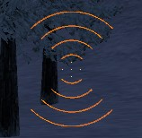

# EasyMask
A simple wrapper for Stencil functions.
It makes it easier to work with masks in 2d rendering context, like HUDPaint or Panel:Paint()
## clientside Functions
```lua
EZMASK.DrawWithMask(function Mask, function ToDraw)
```
### Help
1.  The first argument is a function that draws geometry, but NOT textures (e.g.: *surface.DrawPoly* or *surface.DrawRect*).
2.  The second argument is a function that draws geometry or textures to be masked.
## Example
Draws orange circles inside a hourglass-like shape.
```lua
hook.Add("HUDPaint", "EasyMask Example", function()
    EZMASK.DrawWithMask(function()
        surface.SetDrawColor(color_white)
        surface.DrawPoly{
            {x = ScrW() * 0.5, y = ScrH() * 0.5},
            {x = ScrW() * 0.5 - 64, y = ScrH() * 0.5 - 64},
            {x = ScrW() * 0.5 + 64, y = ScrH() * 0.5 - 64},
            {x = ScrW() * 0.5, y = ScrH() * 0.5},
            {x = ScrW() * 0.5 + 64, y = ScrH() * 0.5 + 64},
            {x = ScrW() * 0.5 - 64, y = ScrH() * 0.5 + 64},
        }
    end, function()
        surface.DrawCircle(ScrW() * 0.5, ScrH() * 0.5, 16, Color(255, 127, 0))
        surface.DrawCircle(ScrW() * 0.5, ScrH() * 0.5, 32, Color(255, 127, 0))
        surface.DrawCircle(ScrW() * 0.5, ScrH() * 0.5, 48, Color(255, 127, 0))
        surface.DrawCircle(ScrW() * 0.5, ScrH() * 0.5, 64, Color(255, 127, 0))
    end)
end)
```

